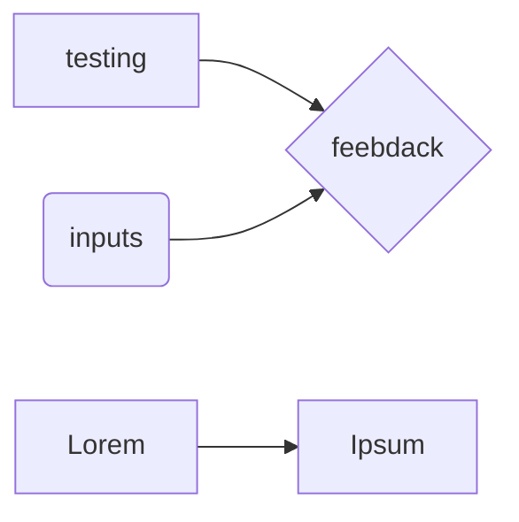
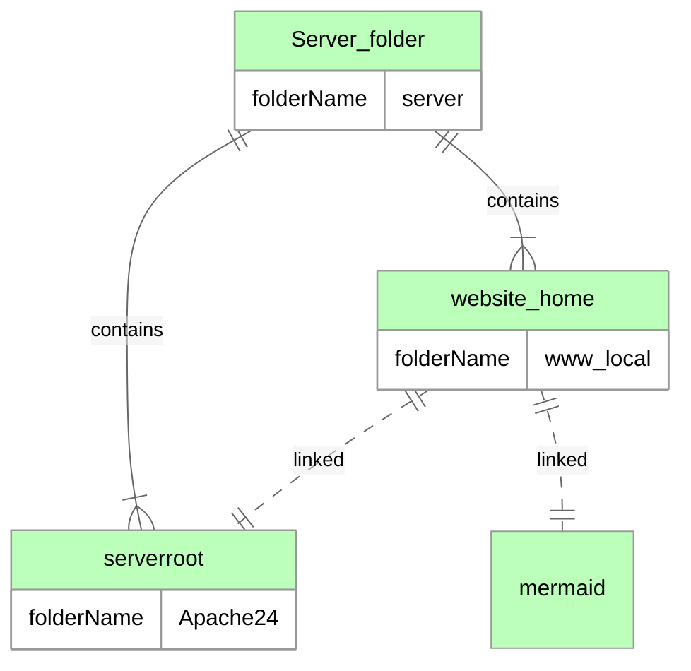
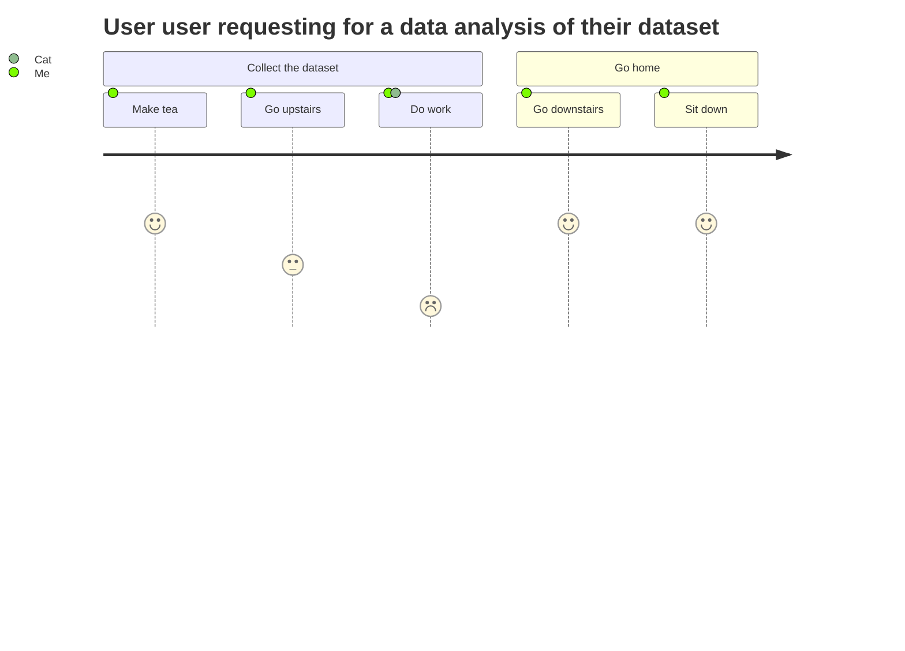
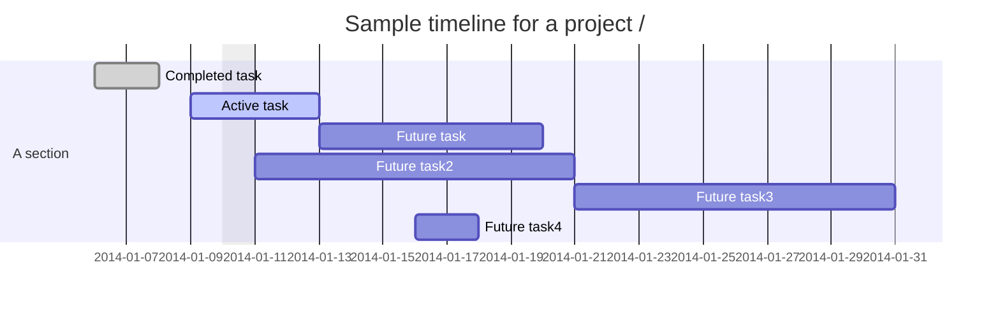
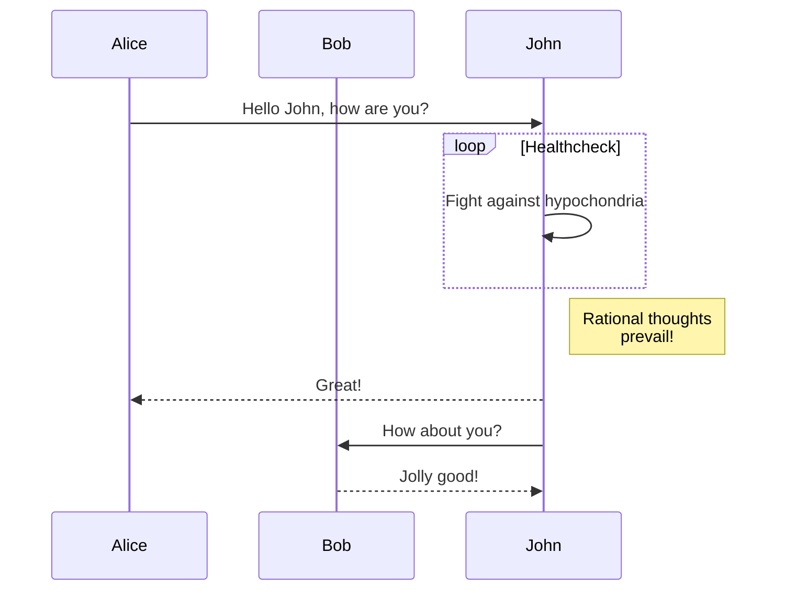
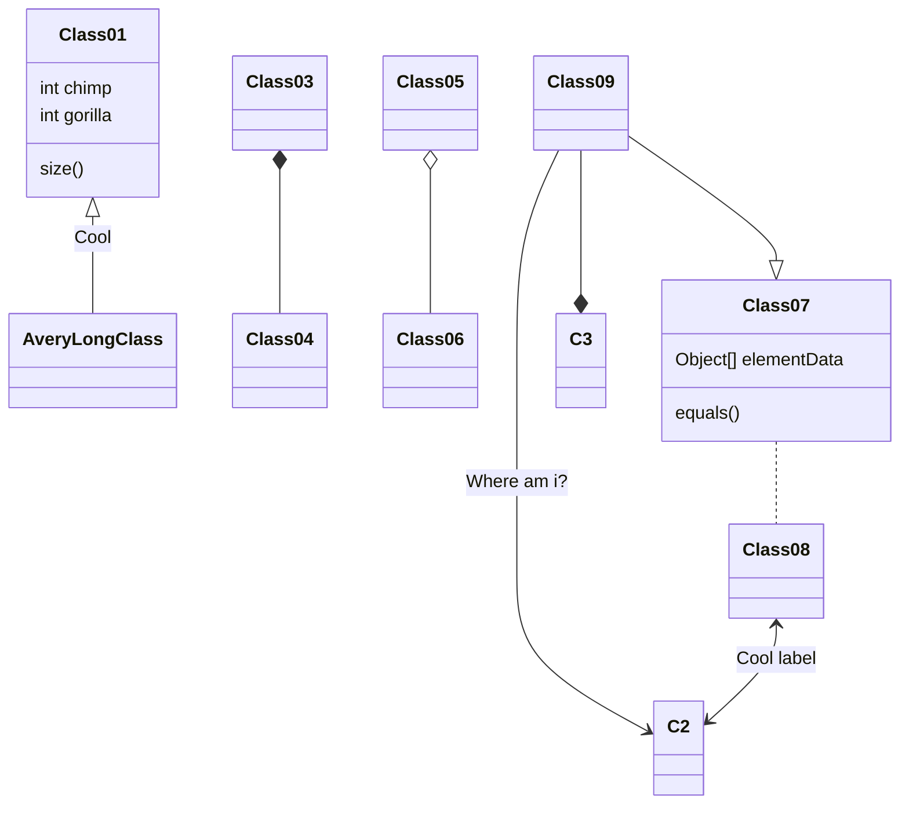

```mermaid
    flowchart LR
    start[testing] --> stop{feebdack}
    receive(inputs) --> stop{feebdack}
    Lorem --> Ipsum
    click Lorem "http://www.google.com" "tooltop" _self
    click Ipsum "http://www.google.com" "tooltop" _blank
```

```mermaid
    erDiagram
    %%{init:{"theme":"neutral",
    "themeVariables": {
    "mainBkg":"#bbffbb",
    "textColor":"black"
    }} }%%
    Server_folder {
    folderName server
    }

    serverroot {
    folderName Apache24
    }

    website_home {
    folderName www_local
    }

    Server_folder || -- |{ serverroot : contains
    Server_folder || -- |{ website_home : contains
    website_home || .. || serverroot : linked
    website_home || .. || mermaid : linked
```

```mermaid 
    journey
    title User user requesting for a data analysis of their dataset
    section Collect the dataset
    Make tea: 5: Me
    Go upstairs: 3: Me
    Do work: 1: Me, Cat
    section Go home
    Go downstairs: 5: Me
    Sit down: 5: Me
    
```

```mermaid       
    gantt
    dateFormat YYYY-MM-DD
    title Sample timeline for a project /
    excludes weekdays 2014-01-10

    section A section
    Completed task :done, des1, 2014-01-06,2014-01-08
    Active task :active, des2, 2014-01-09, 3d
    Future task : des3, after des2, 7d
    Future task2 : des4, 2014-01-11, 10d
    Future task3 : des5, after des4, 10d
    Future task4 : des6, 2014-01-16,2014-01-18
```

```mermaid     
    sequenceDiagram
    participant Alice
    participant Bob
    Alice->>John: Hello John, how are you?
    loop Healthcheck
        John->>John: Fight against hypochondria
    end
        Note right of John: Rational thoughts <br />prevail!
    John-->>Alice: Great!
    John->>Bob: How about you?
    Bob-->>John: Jolly good!
```

```mermaid     
    classDiagram
    Class01 <|-- AveryLongClass : Cool 
    Class03 *-- Class04 
    Class05 o-- Class06 
    Class07 .. Class08 
    Class09 --> C2 : Where am i?
    Class09 --* C3
    Class09 --|> Class07
    Class07 : equals()
    Class07 : Object[] elementData
    Class01 : size()
    Class01 : int chimp
    Class01 : int gorilla
    Class08 <--> C2: Cool label
```